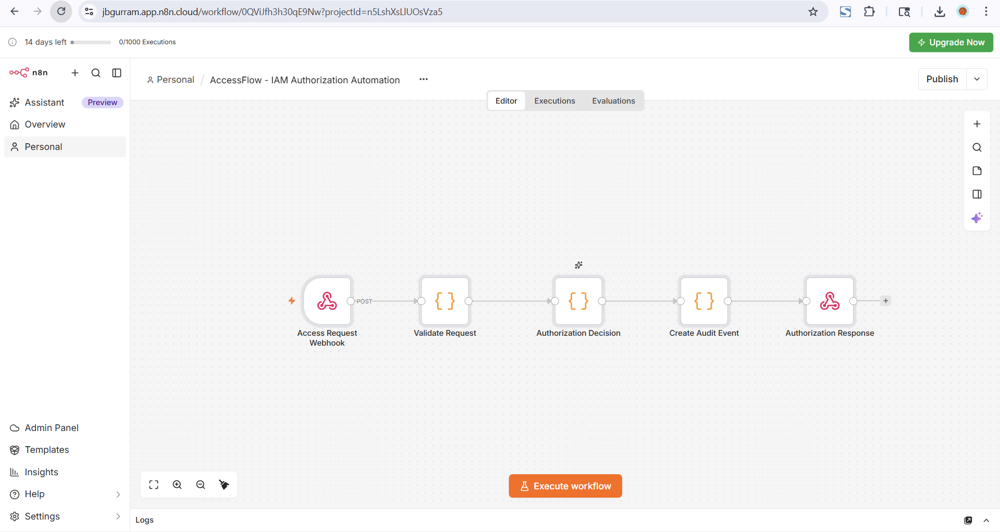
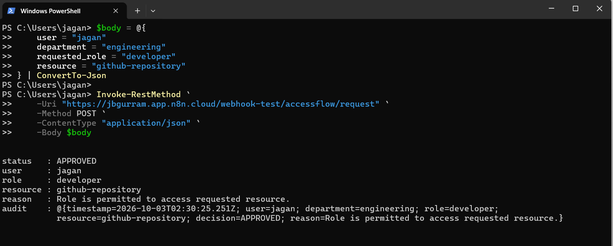
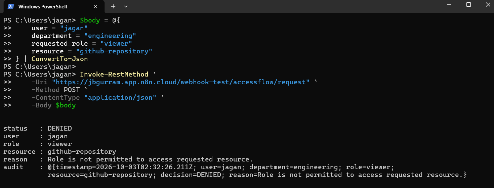
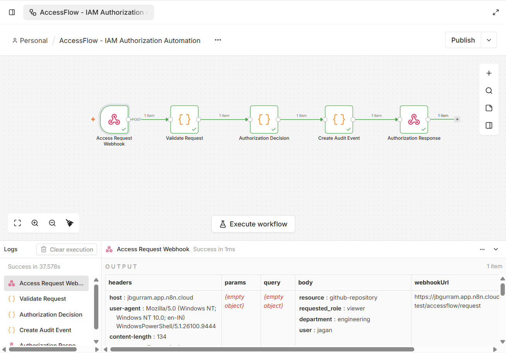

# AccessFlow — IAM Authorization Automation

A lightweight **IAM authorization automation workflow** built with **n8n** that demonstrates how access requests can be validated, evaluated against role-based policies, automatically approved or denied, and recorded as audit events.

AccessFlow focuses on the practical automation of **IAM authorization workflows**, combining **RBAC concepts, REST/webhook integration, JavaScript-based decision logic, and audit logging**.

---

## 🚀 Overview

In a typical application environment, access requests need to be evaluated against authorization policies before a user is allowed to access a resource.

AccessFlow automates this process through an n8n workflow:

```text
Access Request
      │
      ▼
Webhook
      │
      ▼
Request Validation
      │
      ▼
Authorization Decision
      │
      ▼
Audit Event
      │
      ▼
Authorization Response
```

The workflow receives an access request, validates the request data, checks the requested role against predefined resource permissions, generates an authorization decision, creates an audit event, and returns the result as a JSON response.

---

# 🎯 Objectives

The project was developed to demonstrate practical understanding of:

- IAM fundamentals
- Role-Based Access Control (RBAC)
- Authorization policy evaluation
- REST API and webhook integration
- Workflow automation
- Authorization decision logic
- Audit logging
- JSON request/response handling
- Positive and negative authorization testing

---

# ⚙️ Technologies Used

| Technology | Usage |
|---|---|
| **n8n** | Workflow automation and orchestration |
| **JavaScript** | Request validation and authorization logic |
| **REST API / Webhook** | Access-request intake |
| **JSON** | Request and response data |
| **IAM / RBAC** | Authorization model |
| **PowerShell** | API testing |
| **Git / GitHub** | Version control and documentation |

---

# 🔐 Authorization Model

AccessFlow uses a simple **Role-Based Access Control (RBAC)** model.

Each role is associated with a predefined set of resources.

### Current Policy

| Role | Allowed Resources |
|---|---|
| `developer` | `github-repository`, `staging-environment` |
| `analyst` | `analytics-dashboard` |
| `viewer` | `documentation` |

The workflow checks whether the requested resource is permitted for the requested role.

### Example

```text
developer → github-repository
```

Result:

```text
APPROVED
```

Whereas:

```text
viewer → github-repository
```

Result:

```text
DENIED
```

This demonstrates a basic authorization policy evaluation rather than simply accepting every access request.

---

# 🔄 Workflow Components

## 1. Access Request Webhook

The workflow starts with an HTTP `POST` webhook.

Example request:

```json
{
  "user": "jagan",
  "department": "engineering",
  "requested_role": "developer",
  "resource": "github-repository"
}
```

The webhook acts as the entry point for the authorization workflow.

---

## 2. Request Validation

The validation step checks whether the required request fields are present:

```text
user
department
requested_role
resource
```

If required information is missing, the workflow returns a `DENIED` response with the missing fields identified.

---

## 3. Authorization Decision

The authorization node evaluates the requested role against the predefined resource policy.

Conceptually:

```text
Requested Role
      ↓
Allowed Resources
      ↓
Requested Resource
      ↓
APPROVED / DENIED
```

For example:

```javascript
developer: [
  "github-repository",
  "staging-environment"
]
```

If the requested resource exists in the role's permitted resource list, the request is approved.

Otherwise, the request is denied.

---

## 4. Audit Event

After the authorization decision, AccessFlow generates an audit event containing:

- Timestamp
- User
- Department
- Requested role
- Requested resource
- Decision
- Reason

Example:

```json
{
  "timestamp": "2026-10-03T02:30:25.251Z",
  "user": "jagan",
  "department": "engineering",
  "role": "developer",
  "resource": "github-repository",
  "decision": "APPROVED",
  "reason": "Role is permitted to access requested resource."
}
```

This provides a basic record of the authorization decision.

---

## 5. Authorization Response

The final node returns the authorization result as JSON.

Example:

```json
{
  "status": "APPROVED",
  "user": "jagan",
  "role": "developer",
  "resource": "github-repository",
  "reason": "Role is permitted to access requested resource."
}
```

---

# 🧪 Testing

The workflow was tested using **PowerShell** against the n8n webhook.

Two authorization scenarios were tested:

### Test 1 — Authorized Request

Request:

```json
{
  "user": "jagan",
  "department": "engineering",
  "requested_role": "developer",
  "resource": "github-repository"
}
```

Expected result:

```text
APPROVED
```

The `developer` role is permitted to access the `github-repository` resource.

---

### Test 2 — Unauthorized Request

Request:

```json
{
  "user": "jagan",
  "department": "engineering",
  "requested_role": "viewer",
  "resource": "github-repository"
}
```

Expected result:

```text
DENIED
```

The `viewer` role is not permitted to access the `github-repository` resource.

---

# 📸 Screenshots

## Workflow Architecture

Complete n8n workflow showing the authorization automation pipeline.



---

## Approved Authorization

Successful authorization test where the `developer` role requests access to the `github-repository` resource.



---

## Denied Authorization

Authorization test where the `viewer` role requests access to the `github-repository` resource and the request is denied.



---

## n8n Execution

End-to-end execution of the workflow showing the processing of the authorization request.



---

# 📁 Project Structure

```text
accessflow-iam-automation/
│
├── examples/
│   └── access-request.json
│
├── screenshots/
│   ├── approved-execution.png
│   ├── denied-execution.png
│   ├── n8n-execution.png
│   └── workflow.png
│
├── workflow/
│   └── accessflow.json
│
├── .gitignore
├── LICENSE
└── README.md
```

---

# 🛠️ Setup

## Prerequisites

- n8n Cloud or self-hosted n8n
- PowerShell or Postman
- Git

## Import the Workflow

1. Open n8n.
2. Create a new workflow.
3. Select **Import from File**.
4. Import:

```text
workflow/accessflow.json
```

5. Open the **Access Request Webhook** node.
6. Start a test execution.
7. Send a `POST` request to the generated webhook test URL.

---

# 🧑‍💻 Test Using PowerShell

Example:

```powershell
$body = @{
    user = "jagan"
    department = "engineering"
    requested_role = "developer"
    resource = "github-repository"
} | ConvertTo-Json

Invoke-RestMethod `
    -Uri "YOUR_N8N_WEBHOOK_TEST_URL" `
    -Method POST `
    -ContentType "application/json" `
    -Body $body
```

The workflow returns the authorization decision and audit information.

---

# 📊 Example Authorization Flow

### Authorized

```text
User: Jagan
       ↓
Role: developer
       ↓
Resource: github-repository
       ↓
Policy Check
       ↓
APPROVED ✓
       ↓
Audit Event
```

### Unauthorized

```text
User: Jagan
       ↓
Role: viewer
       ↓
Resource: github-repository
       ↓
Policy Check
       ↓
DENIED ✗
       ↓
Audit Event
```

---

# 💡 What I Learned

This project helped me practically understand how IAM authorization concepts can be translated into an automated workflow.

Key areas practiced:

- Role-Based Access Control
- Authorization policy design
- Access-request validation
- REST webhook workflows
- Automated decision-making
- Audit-event generation
- JSON data processing
- JavaScript workflow logic
- Positive and negative authorization testing
- n8n workflow automation

---

# 🔮 Future Improvements

The current implementation intentionally uses a small in-workflow policy map for demonstration.

Potential improvements include:

- Connect to a mock IAM REST API
- Store users and roles in a database
- Add an approval workflow
- Store audit events in PostgreSQL
- Add Slack or email approval notifications
- Integrate OAuth 2.0 / OpenID Connect
- Add JWT validation
- Implement dynamic policy management
- Add cloud IAM integration
- Add AI-assisted explanation of authorization decisions
- Add risk-based access evaluation

---

# ⚠️ Disclaimer

AccessFlow is a **learning and demonstration project**.

It does not connect to a real enterprise identity provider and does not provision real-world permissions.

The authorization policies are predefined within the workflow and are intended to demonstrate IAM authorization concepts and workflow automation in a controlled environment.

---

# 👨‍💻 Author

**Gurram Jagan Bhasker**

B.Tech — Cyber Security

Interested in **AI, Automation, Software Development, IAM, Application Security, and AI Security**.

[GitHub](https://github.com/Jaganbhasker1122) · [LinkedIn](https://www.linkedin.com/in/gurramjaganbhasker/) · [Portfolio](https://jaganbhasker-portfolio.netlify.app/)

---

⭐ If you found this project useful, consider giving the repository a star.
